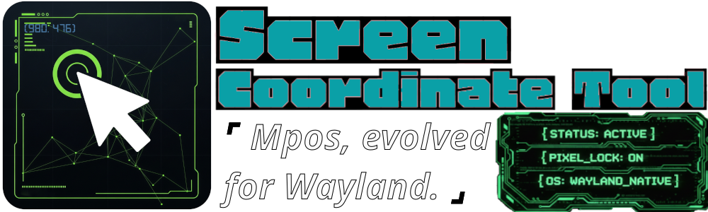
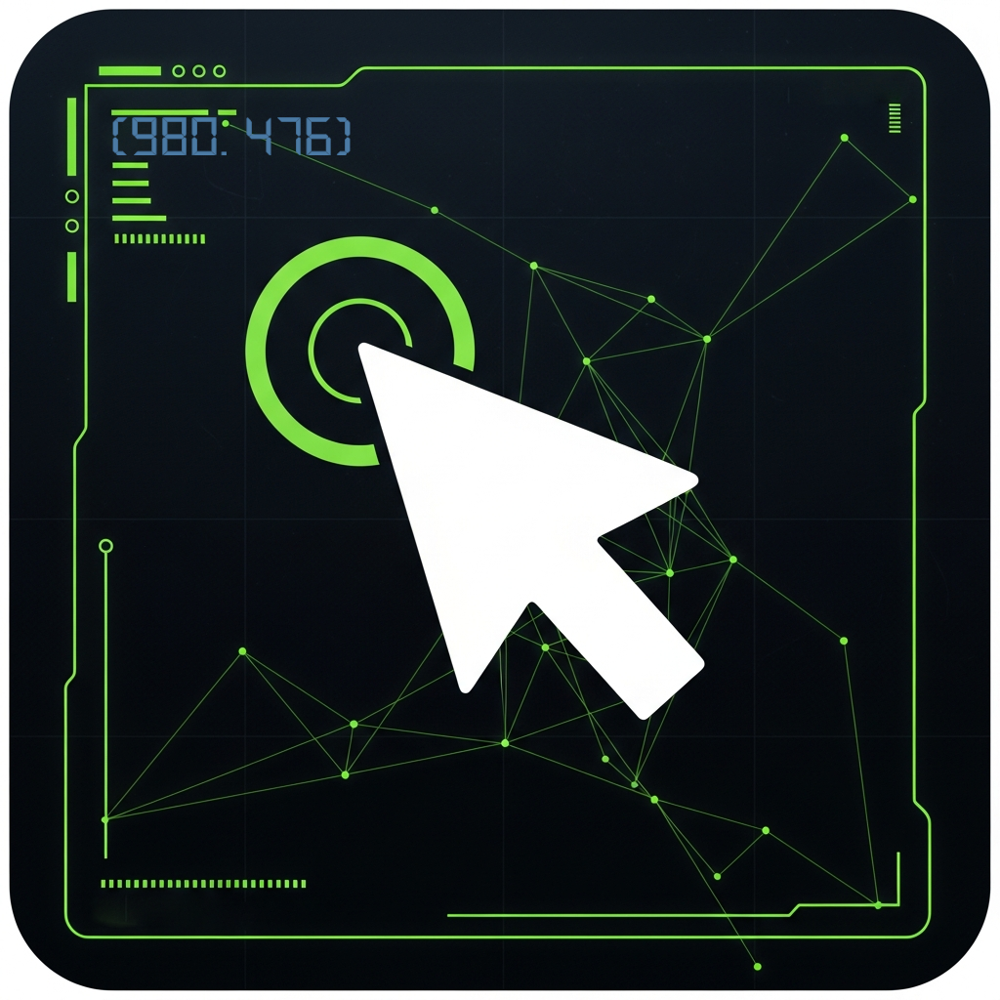

# Screen Coordinate Tool

[](https://opensource.org/licenses/MIT)

> An elegant, feature-rich application for displaying coordinates and measuring distances between pixels, designed specifically for Wayland and X11.

### 🎥 Demo

https://github.com/user-attachments/assets/b096df55-77d6-4de2-9d5a-c0c76d09759a

---


### ✨ Features

- **Instant Coordinates**: Get precise cursor position coordinates with a single click.
- **Distance Measurement**: Measure the exact distance in pixels between any two points on your screen.
- **Organized History**: Name, sort, and group your points and measurements using the built-in tree editor.
- **Sleek UI**: A modern interface built with PyQt5 that feels native to your desktop.

### 📖 How to Use
- **Pick Coordinate**: Left-click anywhere to capture the (X, Y) coordinate.
- **Measure Distance**: Right-click to enter ruler mode and then click another points for the second measurement.
- **Edit Mode**: Press e to enter edit mode where you can rename and delete coordinates and measurements.
- **Manage Items**: Includes built-in window for managing coordinates and measurements with ability to rename, group, and sort.
- **Save**: Data is automatically saved to `~/.screen_coordinate_tool_qt.json` and you can export to text file.

---

### Tech Stack

<details>
<summary><b>View Packages & Dependencies</b></summary>

The tool is built using Python 3 and the following libraries:
- **PyQt5**: Core GUI framework
- **Math**: For distance calculations
- **JSON**: For persistent data storage of your history
- **OS/Datetime**: For system integration and timestamping

</details>

### 🚀 Getting Started

#### Option 1: Quick Install (Recommended)
```bash
git clone https://github.com/mimouza23/Screen_Coordinate_Tool.git
cd Screen_Coordinate_Tool
pip install PyQt5
python main.py
```

#### Option 2: Portable Run
*(Coming Soon: AppImage for one-click execution)*


### 🗺 Roadmap

- [ ] 🔍 **Magnifying Lens**: Above-cursor zoom for pixel-perfect precision (similar to Firefox's color picker).
- [ ] 🎨 **Color Picker**: Store hex/RGB values along with coordinates.
- [ ] 🔄 **Export Options**: Export measurements to CSV or JSON.

---



---
*Created by [mimouza23](https://github.com/mimouza23)*
